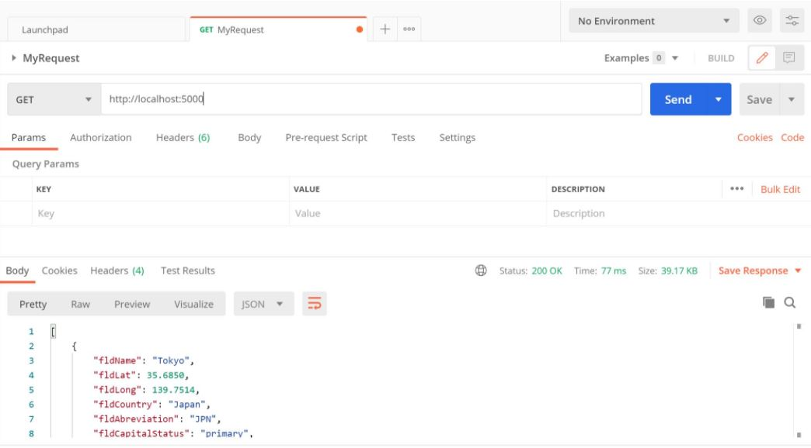
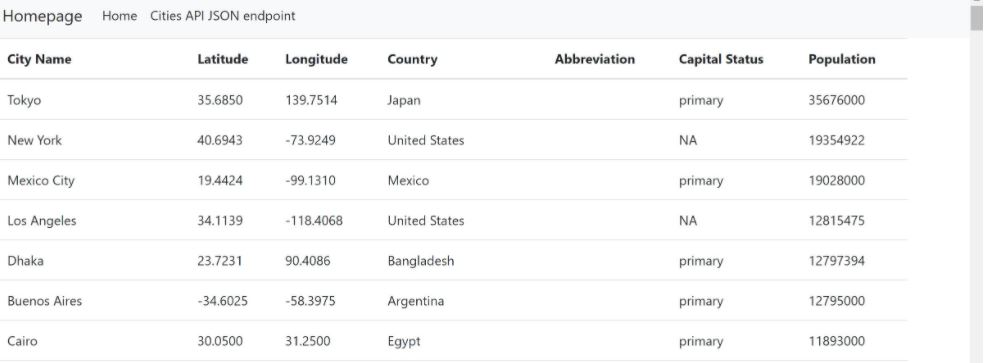
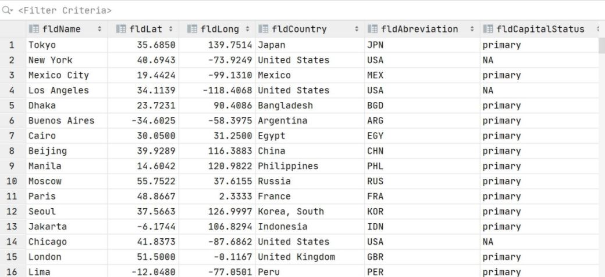

# WebappPart2
# Assignment Part 2

# Project Description

This project is a homework assignment to teach how to get Pycharm setup with Docker, Flash, MySQL

# Postman Data

# Part 2 Local Host Data

# Query Data

